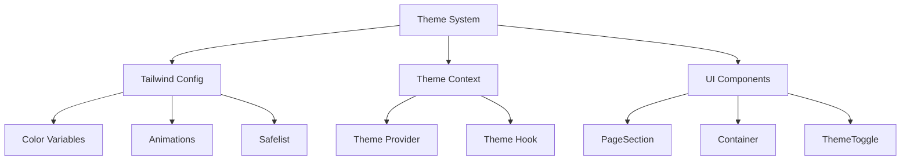
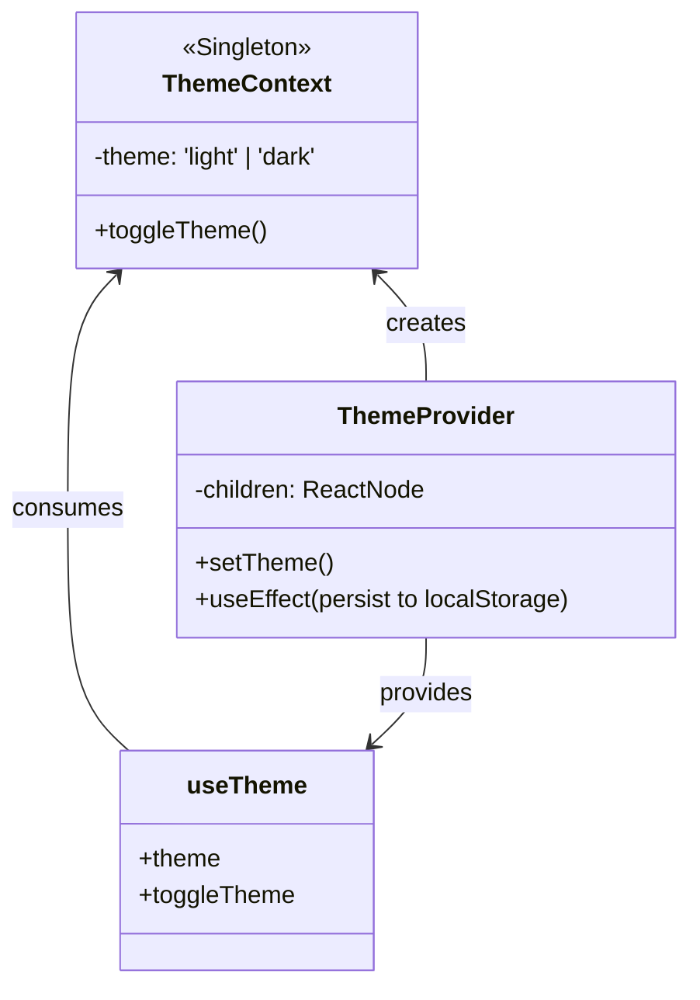
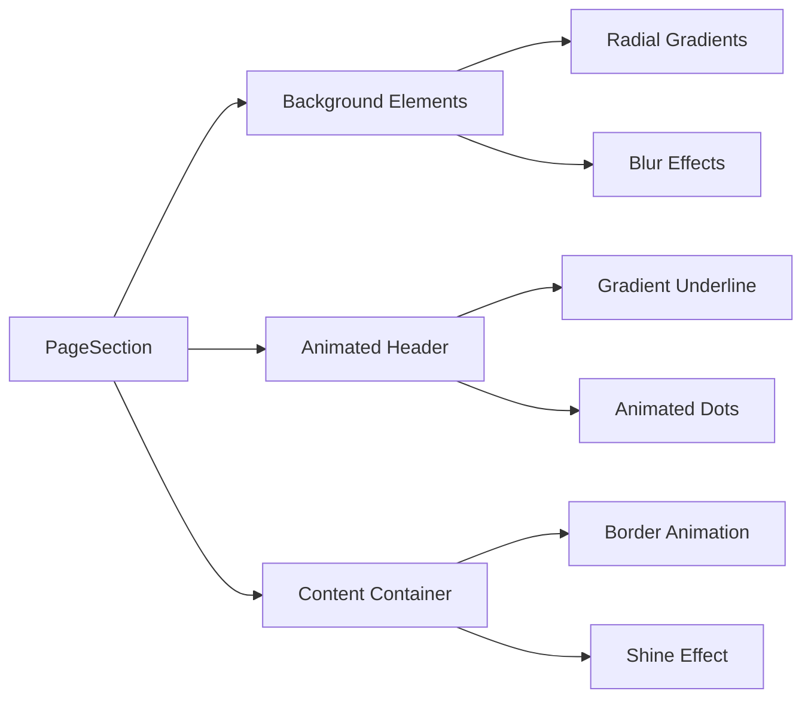
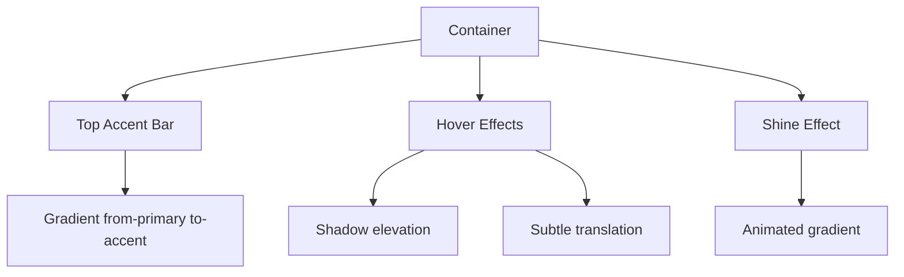
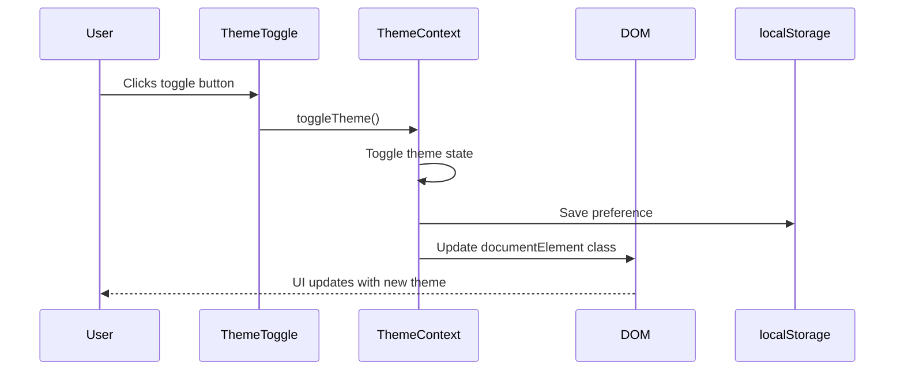
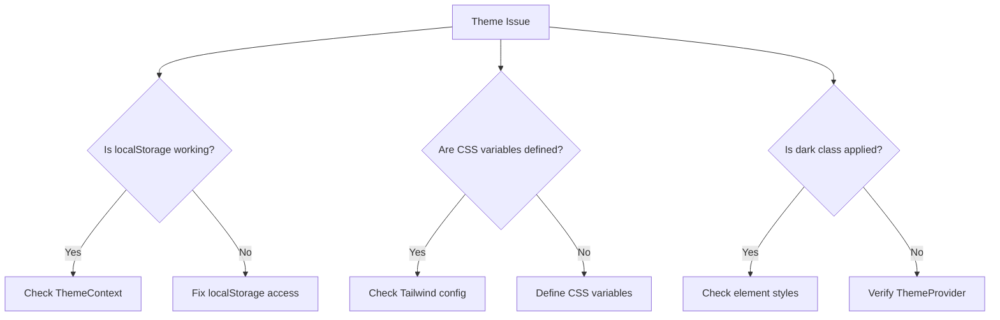
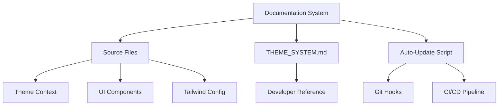
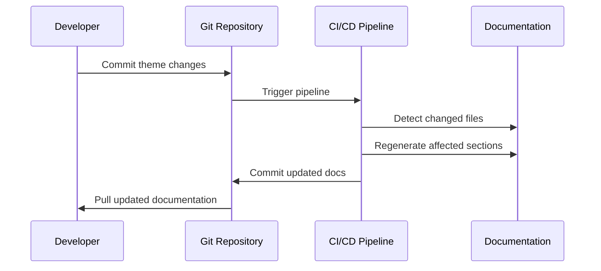
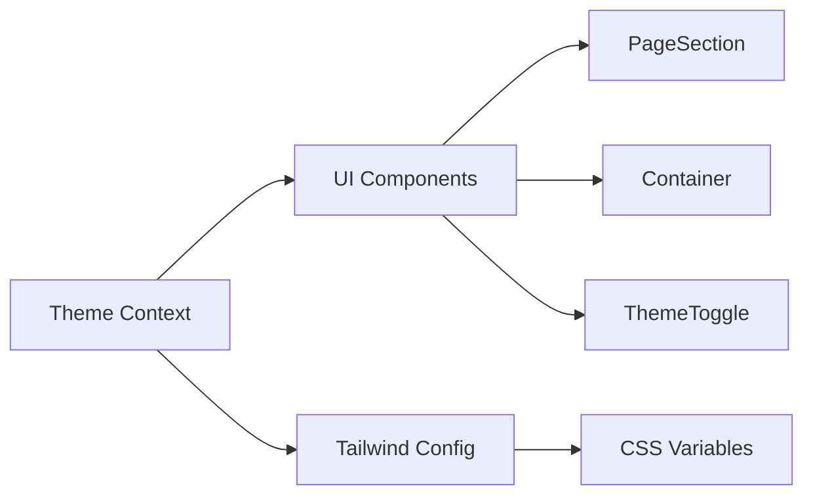

# IELTSMaster Theme System & UI Components Documentation

## Comprehensive Theme System Architecture



## 1. Tailwind CSS Configuration (`tailwind.config.js`)

### Core Features:
- **Class-based dark mode** (`darkMode: 'class'`)
- **CSS Variable Integration** for theme colors
- **Custom Animations** for enhanced UI effects
- **Safelist Optimization** for critical classes

### Color System:


### Key Configurations:
```javascript
module.exports = {
  darkMode: 'class',
  content: [
    './pages/**/*.{js,ts,jsx,tsx}',
    './components/**/*.{js,ts,jsx,tsx}',
    // ... other paths
  ],
  theme: {
    extend: {
      colors: {
        // Theme-aware colors
        primary: 'rgb(var(--color-primary) / <alpha-value>)',
        background: 'rgb(var(--color-background) / <alpha-value>)',
        // ... other colors
      },
      animation: {
        backgroundMove: 'backgroundAnimation 10s linear infinite'
      },
      keyframes: {
        backgroundAnimation: {
          '0%': { 'background-position': '0% 0%' },
          '50%': { 'background-position': '100% 100%' },
          '100%': { 'background-position': '0% 0%' }
        }
      }
    }
  },
  safelist: [
    // Critical utility classes
    'flex', 'grid', 'bg-background', 
    'text-primary', 'animate-backgroundMove',
    // ... other safelisted classes
  ]
};
```

## 2. Theme Context Implementation (`ThemeContext.tsx`)

### Architecture:


### Key Features:
- **LocalStorage Persistence**: Remembers user preference
- **Automatic Class Management**: Toggles 'light'/'dark' on document root
- **Simple API**: `useTheme()` hook provides theme state and toggle function

### Usage Example:
```javascript
const { theme, toggleTheme } = useTheme();

return (
  <button onClick={toggleTheme}>
    {theme === 'dark' ? 'Light Mode' : 'Dark Mode'}
  </button>
);
```

## 3. UI Components

### 3.1 PageSection Component
**Purpose**: Creates consistent section containers with theme-aware decorations



**Props**:
- `title`: Section header text
- `className`: Additional CSS classes
- `children`: Content to render

**Features**:
- Theme-aware background decorations
- Animated header with gradient underline
- Pulse animation on decorative dots
- Shine effect on hover

### 3.2 Container Component
**Purpose**: Creates consistent card-like containers with interactive effects

**Props**:
- `className`: Additional CSS classes
- `hoverable`: Enables hover effects (default: true)
- `onClick`: Click handler

**Features**:


### 3.3 ThemeToggle Component
**Purpose**: Simple theme toggle button with theme-aware icons

**Implementation**:
```javascript
const { theme, toggleTheme } = useTheme();

return (
  <button onClick={toggleTheme} aria-label="Toggle theme">
    {theme === 'dark' ? (
      <span className="text-yellow-400">☀️</span>
    ) : (
      <span className="text-gray-700">🌙</span>
    )}
  </button>
);
```

## 4. Theme Implementation Guide

### Step 1: Wrap Application with ThemeProvider
```javascript
// _app.tsx
import { ThemeProvider } from '@/context/ThemeProvider';

function MyApp({ Component, pageProps }) {
  return (
    <ThemeProvider>
      <Component {...pageProps} />
    </ThemeProvider>
  );
}
```

### Step 2: Use CSS Variables
```css
/* globals.css */
:root {
  --color-primary: 79, 70, 229;
  --color-background: 255, 255, 255;
  --color-foreground: 17, 24, 39;
}

.dark {
  --color-primary: 99, 102, 241;
  --color-background: 17, 24, 39;
  --color-foreground: 243, 244, 246;
}
```

### Step 3: Use Theme in Components
```javascript
const { theme } = useTheme();

// Theme-aware class application
<div className={theme === 'dark' ? 'bg-gray-900' : 'bg-white'}>
  <h2 className={theme === 'dark' ? 'text-white' : 'text-gray-900'}>
    Theme Aware Component
  </h2>
</div>
```

## 5. Theme Switching Flow



## 6. Best Practices

1. **Use CSS Variables**: Always reference colors through CSS variables
```css
.element {
  background-color: rgb(var(--color-background));
}
```

2. **Theme-Aware Animations**:
```javascript
<div className={`${theme === 'light' ? 'bg-primary' : 'bg-accent'}`}>
```

3. **Component Composition**:
```javascript
<PageSection title="Features">
  <Container>
    <FeatureCard />
  </Container>
</PageSection>
```

4. **Performance Optimization**:
- Use `safelist` for critical utility classes
- Prefer CSS animations over JavaScript animations
- Memoize theme-dependent calculations

## 7. Theme Variables Reference

| Variable            | Light Mode          | Dark Mode            |
|---------------------|---------------------|----------------------|
| `--color-primary`   | `79, 70, 229` (purple) | `99, 102, 241` (indigo) |
| `--color-background`| `255, 255, 255` (white) | `17, 24, 39` (dark blue) |
| `--color-foreground`| `17, 24, 39` (dark gray) | `243, 244, 246` (light gray) |
| `--color-accent`    | `139, 92, 246` (violet) | `167, 139, 250` (light violet) |
| `--color-border`    | `229, 231, 235` (gray) | `55, 65, 81` (dark gray) |

## 8. Troubleshooting

**Common Issues:**
1. **Theme not persisting**:
   - Verify localStorage usage in ThemeContext
   - Check for conflicts with other theme systems

2. **CSS variables not updating**:
   - Ensure `:root` and `.dark` selectors in CSS
   - Verify Tailwind is properly configured

3. **Animation performance issues**:
   - Use `will-change: transform` for animated elements
   - Limit complex animations on mobile devices

4. **Class conflicts**:
   - Use `safelist` for critical classes
   - Avoid arbitrary values in class names



This documentation provides a comprehensive overview of the theme system architecture, component implementations, and best practices for maintaining a consistent, theme-aware UI throughout the IELTSMaster platform.


# IELTSMaster Theme System & UI Documentation

## How to Maintain This Documentation

### 1. Save as Markdown File
Create a file named `THEME_SYSTEM.md` in your project's root directory and paste this content.

### 2. Version Control Integration
```bash
# Add to git
git add THEME_SYSTEM.md

# Commit changes
git commit -m "Update theme system documentation"

# Push to repository
git push origin main
```

### 3. Auto-Update Workflow
Create a script to regenerate documentation on changes:

```bash
#!/bin/bash
# scripts/update_docs.sh

# Monitor theme-related files
FILES=(
  "tailwind.config.js"
  "src/context/ThemeContext.tsx"
  "src/components/PageSection.tsx"
  "src/components/Container.tsx"
  "src/components/ThemeToggle.tsx"
)

# Check for changes
for file in "${FILES[@]}"; do
  if [[ $(git diff HEAD@{1}..HEAD -- "$file") != "" ]]; then
    echo "Changes detected in $file - updating documentation..."
    # Regenerate documentation (pseudocode)
    generate-theme-docs > THEME_SYSTEM.md
    git add THEME_SYSTEM.md
    git commit -m "Auto-update theme documentation"
    break
  fi
done
```

### 4. Visual Documentation Architecture


## Documentation Update Strategy

### 1. Change Detection Matrix
| File Changed | Documentation Section Affected | Auto-Update Action |
|--------------|--------------------------------|--------------------|
| `tailwind.config.js` | Tailwind Configuration, Color System | Regenerate config tables |
| `ThemeContext.tsx` | Theme Context API | Update context diagram |
| `PageSection.tsx` | UI Components → PageSection | Update component examples |
| `Container.tsx` | UI Components → Container | Update props table |
| `ThemeToggle.tsx` | UI Components → ThemeToggle | Update usage examples |

### 2. Update Workflow


### 3. Manual Update Tags
Use special comments in source files to mark documentation blocks:

```tsx
// src/context/ThemeContext.tsx
// DOC-START:theme-context-api
export const ThemeProvider = ({ children }) => {
  // Implementation...
}
// DOC-END:theme-context-api
```

Then in your update script:
```bash
# Extract documentation blocks
awk '/DOC-START:theme-context-api/,/DOC-END:theme-context-api/' \
  src/context/ThemeContext.tsx >> docs_sections/theme_context.md
```

## Full Documentation

### 1. Theme System Overview


### 2. Tailwind Configuration (`tailwind.config.js`)
```javascript
module.exports = {
  darkMode: 'class',
  content: [
    './pages/**/*.{js,ts,jsx,tsx}',
    './components/**/*.{js,ts,jsx,tsx}',
    // ... other paths
  ],
  theme: {
    extend: {
      colors: {
        primary: 'rgb(var(--color-primary) / <alpha-value>)',
        background: 'rgb(var(--color-background) / <alpha-value>)',
        // ... other colors
      },
      animation: {
        backgroundMove: 'backgroundAnimation 10s linear infinite'
      }
    }
  }
};
```

#### Color Variables Reference
| Variable            | Light Mode          | Dark Mode            |
|---------------------|---------------------|----------------------|
| `--color-primary`   | `79, 70, 229`       | `99, 102, 241`      |
| `--color-background`| `255, 255, 255`     | `17, 24, 39`        |
| `--color-foreground`| `17, 24, 39`        | `243, 244, 246`     |
| `--color-accent`    | `139, 92, 246`      | `167, 139, 250`     |

### 3. Theme Context (`ThemeContext.tsx`)
```tsx
import { createContext, useContext, useEffect, useState } from 'react';

type Theme = 'light' | 'dark';

const ThemeContext = createContext<{
  theme: Theme;
  toggleTheme: () => void;
} | undefined>(undefined);

export const ThemeProvider = ({ children }) => {
  const [theme, setTheme] = useState<Theme>('light');

  useEffect(() => {
    const storedTheme = localStorage.getItem('theme') as Theme;
    if (storedTheme) setTheme(storedTheme);
  }, []);

  useEffect(() => {
    document.documentElement.classList.remove('light', 'dark');
    document.documentElement.classList.add(theme);
    localStorage.setItem('theme', theme);
  }, [theme]);

  const toggleTheme = () => setTheme(prev => prev === 'light' ? 'dark' : 'light');

  return (
    <ThemeContext.Provider value={{ theme, toggleTheme }}>
      {children}
    </ThemeContext.Provider>
  );
};

export const useTheme = () => {
  const context = useContext(ThemeContext);
  if (!context) throw new Error('useTheme must be used within ThemeProvider');
  return context;
};
```

### 4. UI Components

#### PageSection Component (`PageSection.tsx`)
```tsx
import { useTheme } from '@/context/ThemeContext';

export default function PageSection({ children, title, className = '' }) {
  const { theme } = useTheme();

  return (
    <section className={`relative py-16 ${className}`}>
      {/* Theme-aware background elements */}
      <div className="absolute inset-0 -z-10 overflow-hidden">
        <div className={`absolute top-1/4 left-0 w-72 h-72 rounded-full blur-[100px] opacity-20
            ${theme === 'light' ? 'bg-primary' : 'bg-accent'}`} />
      </div>
      
      {/* Content container */}
      <div className="max-w-7xl mx-auto px-4 sm:px-6 lg:px-8">
        <div className="text-center mb-16">
          <h2 className={`text-4xl md:text-5xl font-bold tracking-tight
              ${theme === 'light' ? 'text-gray-900' : 'text-white'}`}>
            {title}
          </h2>
        </div>
        {/* ... rest of component */}
      </div>
    </section>
  );
}
```

#### Container Component (`Container.tsx`)
```tsx
export default function Container({ 
  children, 
  className = "",
  hoverable = true
}) {
  return (
    <div className={`
      relative
      bg-white dark:bg-gray-800
      border border-gray-200 dark:border-gray-700
      rounded-xl
      transition-all duration-300
      ${hoverable && 'hover:shadow-lg hover:-translate-y-1'}
      group
      ${className}
    `}>
      {/* Top accent bar */}
      <div className="absolute top-0 left-0 right-0 h-[3px] bg-gradient-to-r from-primary to-accent" />
      
      <div className="pt-5 pb-4 px-5">
        {children}
      </div>
    </div>
  );
}
```

#### ThemeToggle Component (`ThemeToggle.tsx`)
```tsx
import { useTheme } from '@/context/ThemeContext';

export default function ThemeToggle() {
  const { theme, toggleTheme } = useTheme();

  return (
    <button
      onClick={toggleTheme}
      className="p-2 rounded-full bg-card border border-border"
      aria-label="Toggle theme"
    >
      {theme === 'dark' ? (
        <span className="text-yellow-400">☀️</span>
      ) : (
        <span className="text-gray-700">🌙</span>
      )}
    </button>
  );
}
```

### 5. Usage Guide

#### Implementing ThemeProvider
```jsx
// src/pages/_app.tsx
import { ThemeProvider } from '@/context/ThemeContext';

export default function MyApp({ Component, pageProps }) {
  return (
    <ThemeProvider>
      <Component {...pageProps} />
    </ThemeProvider>
  );
}
```

#### Using Theme in Components
```jsx
import { useTheme } from '@/context/ThemeContext';

function ExampleComponent() {
  const { theme, toggleTheme } = useTheme();
  
  return (
    <div className={theme === 'dark' ? 'bg-gray-900' : 'bg-white'}>
      <button onClick={toggleTheme}>
        Switch to {theme === 'dark' ? 'Light' : 'Dark'} Mode
      </button>
    </div>
  );
}
```

## Maintenance Checklist
1. **After modifying theme files**:
   - Run update script: `./scripts/update_docs.sh`
   - Verify changes in `THEME_SYSTEM.md`
   - Commit updated documentation

2. **Monthly audit**:
   - Review all theme-related components
   - Test theme switching behavior
   - Update color variables table
   - Verify documentation examples

3. **On new component creation**:
   - Add to documentation structure
   - Include usage examples
   - Add to auto-update script

This documentation system provides a self-updating reference that stays synchronized with your codebase, ensuring your theme system remains well-documented through all stages of development.